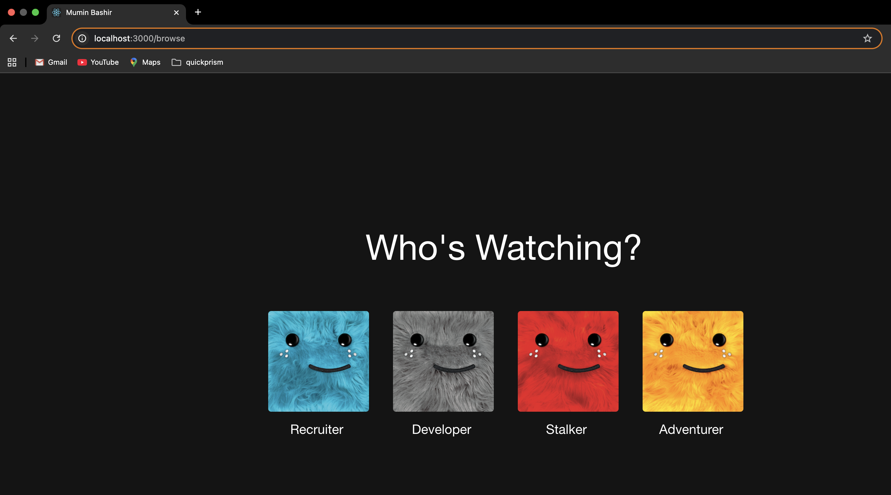

## 🌟 Netflix-Inspired Portfolio Template 🌟

Welcome to your personal portfolio project! 🚀 This website template is designed to showcase your work, skills, and experiences in a Netflix-inspired interface. It's lightweight, customizable, and professional while maintaining an engaging user experience.

**Now with Static JSON Data Management!** ✨ No external CMS required - everything is managed through simple JSON files.


---

## ✨ Features

- 📄 **Static JSON Data**: No external CMS required - manage content through simple JSON files.
- ⚡ **Fast & Responsive**: Built with modern web technologies for seamless performance.
- 🎨 **Fully Customizable**: Easily adapt to your own needs by editing JSON files.
- 📈 **Professional Yet Personal**: Highlights projects, skills, and achievements.
- 🖼️ **Local Asset Management**: Images and documents stored locally in public folder.
- 🎭 **Netflix-Inspired UI**: Engaging interface that captures attention.

---

## 🛠️ Tech Stack

This portfolio is built with love and:

- ⚛️ **React** (Frontend Framework)
- 📊 **TypeScript** (Type Safety)
- 📄 **Static JSON Data** (Content Management)
- 🎨 **CSS3** (Styling)
- 🖼️ **React Icons** (Icon Library)
- 📱 **Responsive Design** (Mobile-First Approach)

---

## ⭐ Show Your Support

If you find this project helpful or inspiring, give it a ⭐ on GitHub—it means the world to me! 🌟

Happy coding! 💻✨

---

## 📚 Getting Started

Want to set this up locally? Follow these steps:

1. **Clone the Repository**: Copy the repository to your local system.
2. **Install Dependencies**: Use a package manager to install the required dependencies.

```bash
nvm install 18
nvm use 18
npm install
```

3. **Customize Your Content**: Edit the JSON files in `src/data/` directory with your information.
4. **Add Your Assets**: Place your images in `public/images/` and documents in `public/documents/`.
5. **Run the Project**: Start the development server.

```bash
npm start
```

6. **Visit the Local Server**: Open your browser and navigate to `http://localhost:3000`.

📖 **For detailed customization instructions, see [CONTENT_GUIDE.md](CONTENT_GUIDE.md)** 

   

---

## 🤝 Contribution Guidelines

Contributions are welcome and appreciated! 🥳 To contribute:

1. Fork the repository.
2. Create a new branch for your feature or fix.
3. Commit your changes with a descriptive message.
4. Push your changes to your branch.
5. Open a Pull Request. 🎉

---

## 🐛 Issues and Feature Requests

Found a bug? Have a feature in mind? 🤔 Feel free to raise an issue or suggest a feature!

1. Go to the **Issues** tab in the repository.
2. Click **New Issue**.
3. Provide a clear description of the bug or feature request.
4. If applicable, include screenshots or steps to reproduce the issue.

Your feedback is valuable and helps make this project better for everyone. Thank you for contributing!

---

## 🌟 Acknowledgments

- Inspired by Netflix's amazing user interface design. 🎬
- Thanks to the React and open-source community. 💻
- Special shoutout to all contributors—you rock! 🤘
- Original concept by Sumanth Samala, now enhanced for static content management.

---

## 📧 Contact Me

- 💼 [Portfolio Website](https://muminbashir.in)
- 📧 Email: [chintusamala96@gmail.com](mailto:belikemumin@gmail.com)
- 🔗 [LinkedIn](https://uk.linkedin.com/in/mumin-bashir)

---

## 📜 License

This project is licensed under the MIT License. Feel free to use it, modify it, and share it! 🌈

---
